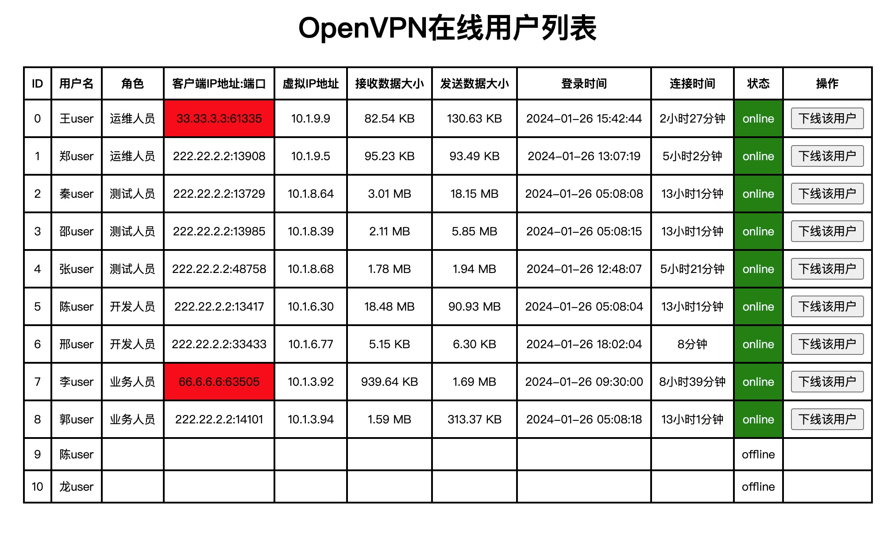

# OpenVPN Manager 

# 一、简介

OpenVPN Manager，一个简单的OpenVPN Web管理工具。通过OpenVPN的管理端口获取数据，然后在Web页面上展示或者操作。

OpenVPN的管理端口详细介绍文章，请参考：https://openvpn.net/community-resources/management-interface/

# 二、功能

- 显示当前登录的客户端信息
- 可下线用户
- 简单的用户名密码认证




# 三、安装部署

## 1、部署所需条件：
- **OpenVPN 服务端需要开起管理端口**

  在OpenVPN服务端配置文件中追加`management 127.0.0.1 123456`，然后重启OpenVPN即可。

- 支持的OpenVPN 版本
  
  2.4.x（2.4.4已测试）

## 2、源码编译部署

> 注意：编译安装时需要第三方命令行工具statik（statik可以将静态资源文件打包进二进制文件中）

```bash
git clone 
cd openvpn-manager
CGO_ENABLED=0 GOOS=linux GOARCH=amd64 go build -o target/openvpn-manager main.go 
nohup ./target/openvpn-manager -host openvpn服务端主机IP地址 -port openvpn管理端口 -admin-passwd OpenVPN Manager管理员admin的密码 -psw-file /etc/openvpn/server/psw-file > /var/log/openvpn-manager.log 2>&1 &
```

## 3、docker方式部署

```bash
docker pull curiouser/openvpn-manager:v1
docker run \
-v $PWD/psw-file:/etc/openvpn/server/psw-file:ro \
-p 30080:9090 \
-it \
curiouser/openvpn-manager:v1 \
-host 172.16.1.2 -port 32099 -admin-passwd 12356789 -psw-file /etc/openvpn/server/psw-file
```

# 四、TODO

新增功能
- [ ] 增加显示最近五条登录日志
- [ ] 增加新增用户的功能
- [ ] 增加对低版本OpenVPN的支持
- [x] 增加Docker部署方式
- [x] 增加显示所有用户功能